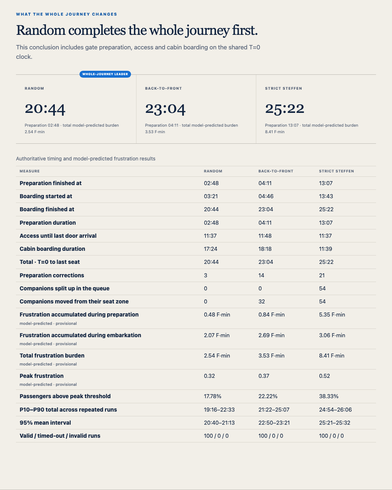

# Boarding Lab

**A smarter boarding order may fill the cabin faster. Is it still better once you count what it costs
to create that order?**

Almost every published comparison of aircraft boarding methods starts its clock when the first
passenger walks through the aircraft door. But somebody has to sort 180 people into that clever
sequence first, and that work happens to the passengers, standing at a gate.

Boarding Lab is a deterministic, passenger-by-passenger simulator that starts the clock earlier — at
the announcement to prepare for boarding — and follows every passenger through gate preparation,
the walk to the aircraft, the aisle, the overhead bin and into their seat. It also tracks a
model-predicted frustration value for each individual, continuously, from T=0.



## What it found

Running Random, Back-to-front and Strict Steffen against **the same 180 passengers** on one
continuous clock, with a gate agent who has to actually call people:

| | Random | Back-to-front | Strict Steffen |
|---|---|---|---|
| Preparation finished | 02:48 | 04:11 | 12:46 |
| Whole journey, T=0 to last seat | **20:44** | 23:04 | 25:01 |
| Total model-predicted frustration | **2.54 F·min** | 3.53 F·min | 8.41 F·min |
| Companions separated | 0 | 32 | 54 |

Strict Steffen boards the *cabin* fastest once people are in position — 11:39 against Random's 17:24.
It loses because building its perfect queue takes nearly thirteen minutes, and because the model
charges it for the 54 passengers it separates from the people they are travelling with.

Across 100 seeded runs (88 with all three strategies valid) Random wins 80, back-to-front 8, and
Strict Steffen 0. The distributions do not overlap: Random's p90 total is 22:36, Strict Steffen's p10
is 24:53.

## What this is not

This is a **research and calibration tool, not an operational decision tool.**

The aircraft mechanics are field-validated published work. The gate preparation model and every
frustration coefficient are **provisional assumptions of this model**, clearly labelled
`model-predicted` throughout the interface and `provisional` in the parameter registry.

In particular, the headline result leans on two numbers the author chose rather than measured: that a
gate agent calling passengers individually takes four seconds each, and that being separated from your
companions adds 0.25 to your stress load. [`RESEARCH.md`](RESEARCH.md) states both plainly, along with
the published evidence that sits in tension with the conclusion — the one experiment that measured
both speed and passenger preference found the *fastest* method was the *least liked*.

Read [`RESEARCH.md`](RESEARCH.md) before quoting any number from this repository.

## Run it

Python 3.11 or newer. No packages to install.

```bash
python3 -m boarding_sim
```

Open <http://127.0.0.1:8080>, then stop with `Control-C`. Use `--port 8765` if 8080 is busy.

## Use it as a library

Every run requires an explicit 32-bit integer seed.

```python
from boarding_sim import run_flight, run_monte_carlo
from boarding_sim.comparison import run_comparison

flight = run_flight({"boarding": {"strategy": "wilma"}}, seed=42)

comparison = run_comparison(None, seed=20260813)          # the fair three-way race
distribution = run_monte_carlo({"boarding": {"strategy": "wilma"}}, runs=100, base_seed=10_000)
```

`boarding_sim.serialization.canonical_json_bytes(result)` gives byte-stable output for storage or
comparison.

## What is modelled

- correlated individual passenger traits and latent stress at T=0;
- families and travelling companions as linked individuals;
- a gate agent who releases passengers by general call, by zone, or one at a time;
- gate movement, crowding, misunderstanding and correction;
- bridge or bus access, including bus capacity, dispatch and two unloading streams;
- 0.4 m cabin cells, one passenger per aisle cell, independent front and rear door streams;
- Weibull luggage stowing and seat-interference resolution;
- per-passenger frustration: current value, peak, accumulated F·minutes, and time above threshold;
- deterministic Monte Carlo quantiles, 95% mean intervals, and valid/timeout/invalid counts.

Not modelled: airport arrival, check-in, security, the terminal journey before T=0, public-address
intelligibility, multiple gate agents, absent passengers, or aircraft other than a 180-seat A320.

## Evidence boundary

| Document | What it holds |
|---|---|
| [`RESEARCH.md`](RESEARCH.md) | The four evidence tiers, the boarding methods in plain language, real-world trials, and what would change the author's mind |
| [`SOURCES.md`](SOURCES.md) | Which source justifies which model parameter |
| [`VALIDATION_PLAN.md`](VALIDATION_PLAN.md) | What must happen before a provisional value may be called calibrated |
| [`MODEL_SPEC.md`](MODEL_SPEC.md) | The normative model specification |
| [`RESULT_SCHEMA.md`](RESULT_SCHEMA.md) | What every published result field means |
| [`config/parameter-registry.json`](config/parameter-registry.json) | Provenance for every configurable value, enforced by tests |

## Project map

- `boarding_sim/` — the deterministic Python simulation package;
- `web/` — rendering-only browser interface, no build step;
- `tests/` — unit, property, integration, API and UI-contract tests;
- `scripts/` — comparison artifact builder and the video renderer;
- `config/` — default scenario, provisional behaviour layer, parameter registry;
- `reference/legacy-js/` — the superseded JavaScript V2 prototype, kept for provenance;
- `docs/` — implementation notes, design specs and plans.

## Local JSON API

- `GET /api/config` — default scenario, strategies, provenance and model status;
- `POST /api/run` — `{"scenario": {...}, "seed": 42}`;
- `POST /api/compare` — the fair three-strategy comparison;
- `POST /api/monte-carlo` — `{"scenario": {...}, "runs": 100, "baseSeed": 10000}`.

Validation failures return HTTP 400 with stable `path`, `code` and `message` issues. A timeout is a
successful HTTP response with `status: "timed_out"`, because it is a modelled outcome.

## Reproducing the published results

```bash
python3 -m unittest discover -s tests -p 'test_*.py'   # simulation and contract tests
npm test                                                # browser modules and legacy reference
python3 -m scripts.build_default_comparison --workers 4 # rebuild the 100-run comparison
npm run render:video                                    # re-render the LinkedIn video
```

## Credit

The three-way presentation is inspired by Adam Jacobs's visualisation of Random, Back-to-front and
Strict Steffen boarding. That work starts the visible race at boarding; Boarding Lab extends the clock
backward to the first preparation instruction and adds provisional passenger-frustration outputs.

## Licence and citation

MIT — see [`LICENSE`](LICENSE). If you use the simulator, cite it via [`CITATION.cff`](CITATION.cff).

Built by Dennis Kefalas. Contributions welcome, especially observational data — see
[`CONTRIBUTING.md`](CONTRIBUTING.md).
