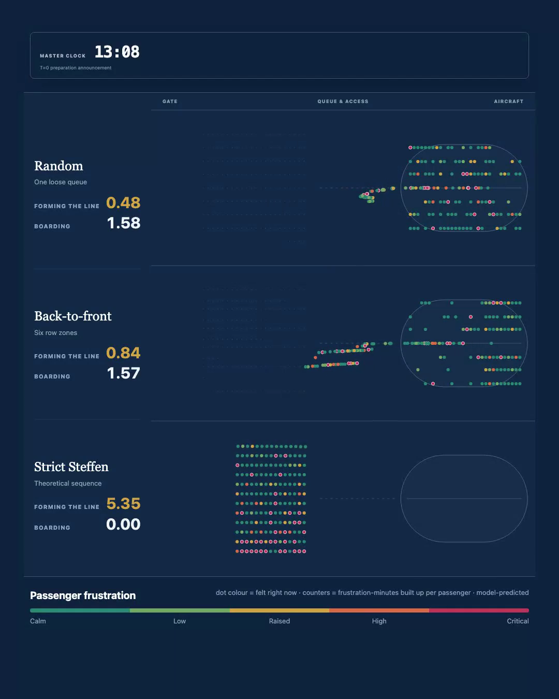

# Boarding Lab

**A smarter boarding order fills the cabin faster. Is it still better once you count what it costs to
create that order?**

Nearly every published comparison of aircraft boarding methods starts its clock when the first
passenger walks through the aircraft door. But somebody has to sort 180 people into that clever
sequence first — and that work happens to the passengers, standing at a gate.

Boarding Lab is a deterministic, passenger-by-passenger simulator that starts the clock earlier, at
the announcement to prepare for boarding, and follows every individual through gate preparation, the
walk to the aircraft, the aisle, the overhead bin and into their seat. It also tracks a
model-predicted frustration value for each passenger, continuously, from T=0.



*At 13:08 Strict Steffen has finally built its perfect queue — and its aircraft is still empty. It
has already spent 5.35 frustration-minutes per passenger to get there. Random, which never sorted
anybody, has been boarding for nearly ten minutes.*
[Watch the 40-second comparison →](docs/media/boarding-frustration.mp4)
· [Change the gate-agent call rate yourself →](https://flybycode.com/boarding)

---

## What it found

Three methods, **the same 180 passengers** — same seats, same bags, same families, same starting
stress — on one continuous clock:

| | Random | Back-to-front | Strict Steffen |
|---|---|---|---|
| Line ready at | 02:48 | 04:11 | **13:07** |
| Boarding started at | 03:21 | 04:46 | 13:43 |
| **Whole journey, T=0 to last seat** | **20:44** | 23:04 | 25:22 |
| Cabin boarding alone | 17:24 | 18:18 | **11:39** |
| Frustration while forming the line | 0.48 | 0.84 | **5.35** F·min |
| Frustration while boarding | 2.07 | 2.69 | 3.06 F·min |
| Companions split up in the queue | 0 | 0 | 54 |
| Companions moved from their seat zone | 0 | 32 | 54 |

**Strict Steffen genuinely is the fastest at filling a cabin** — 11:39 against Random's 17:24, which
is what the published experiments measured and why the method is famous. It still loses the whole
journey by more than four minutes, because building its perfect queue takes just over thirteen.

Back-to-front never splits a group up: its 32 are passengers the companion policy moved to a different
part of the boarding order to keep them together, which is not the same thing.

This is not one lucky seed. Across 100 seeded comparisons, all of which completed, Random wins 92,
back-to-front 8, Strict Steffen **0**. The ranges do not overlap — Random's p90 total is 22:33, Strict
Steffen's p10 is 24:54.

### Reading the frustration numbers

Frustration is measured in **F·min** — frustration-minutes accumulated per passenger. A passenger
sitting at 0.5 frustration for two minutes accumulates 1.0 F·min.

In plain language: **5.35 F·min is as if every passenger spent five and a third minutes completely
fed up before boarding even began.** Random's equivalent is about half a minute.

The two phase figures never overlap and always sum to the total, so you can see exactly where the
cost was created rather than only what it added up to.

---

## What this is not

**This is a research and calibration tool, not an operational decision tool.**

The aircraft mechanics are field-validated published work. **The gate preparation model and every
frustration coefficient are provisional assumptions of this model**, labelled `model-predicted` in
the interface and `provisional` in the parameter registry.

The headline result leans on two numbers chosen rather than measured:

1. **A gate agent calling passengers individually takes four seconds each.** Calling 180 people one
   at a time therefore cannot finish before 11:56, and that single assumption is most of why Strict
   Steffen loses. No published source gives a real gate-agent rate.
2. **Being separated from your travelling companions adds 0.25 to your stress load.** Strict Steffen
   splits up 54 of 180 passengers. That penalty is real but secondary: the thirteen minutes of
   preparation is what drives the result.

The four-second call rate is a scenario input at `preparation.release.passengerIntervalSeconds`, so
anyone can vary it and watch the conclusion move.

There is also published evidence pointing *against* part of the conclusion. The one experiment that
measured both boarding speed and passenger preference (MythBusters, 2014) found the **fastest** method
was the **least liked** — passengers preferred an orderly process to a quick one. This model has no
term for a process feeling organised, so Random's frustration advantage may be overstated.

All of this is set out in **[RESEARCH.md](RESEARCH.md)**, including what would change the author's
mind. **Read it before quoting any number from this repository.**

---

## Run it

Python 3.11 or newer. No packages to install.

```bash
git clone https://github.com/kefalasdion/boarding-lab.git
cd boarding-lab
python3 -m boarding_sim
```

Open <http://127.0.0.1:8080> and stop with `Control-C`. Use `--port 8765` if 8080 is busy.

The page opens on a precomputed 100-run comparison, so nothing has to be simulated before you see
results. You can then change the flight and rerun live.

### Use it as a library

Every run requires an explicit 32-bit integer seed. Same scenario plus same seed always produces
byte-identical output.

```python
from boarding_sim import run_flight, run_monte_carlo
from boarding_sim.comparison import run_comparison

flight = run_flight({"boarding": {"strategy": "wilma"}}, seed=42)
comparison = run_comparison(None, seed=20260813)
distribution = run_monte_carlo({"boarding": {"strategy": "wilma"}}, runs=100, base_seed=10_000)
```

`boarding_sim.serialization.canonical_json_bytes(result)` produces byte-stable output for storage or
comparison.

### Local JSON API

| Endpoint | Purpose |
|---|---|
| `GET /api/config` | Default scenario, strategies, provenance, model status |
| `POST /api/run` | `{"scenario": {...}, "seed": 42}` |
| `POST /api/compare` | The fair three-strategy comparison |
| `POST /api/monte-carlo` | `{"scenario": {...}, "runs": 100, "baseSeed": 10000}` |

Validation failures return HTTP 400 with stable `path`, `code` and `message` issues. A timeout is a
**successful** response with `status: "timed_out"`, because a strategy failing to finish is a modelled
outcome, not an error.

---

## How the model works

The simulation keeps three parts strictly separate:

**1 · Passenger state at T=0.** 180 individuals with correlated traits: walking speed, luggage,
compliance, trust in information, crowd and wait sensitivity, connection pressure, and a starting
stress load derived from delay, prior gate wait, airport dwell and fatigue. Families and companions
are linked. Nobody starts in a queue.

**2 · Preparation.** A gate agent releases passengers — one general call for Random, six zone calls
20 seconds apart for back-to-front, or individual calls 4 seconds apart for Strict Steffen. Released
passengers decide when to move, walk to their required position, get in each other's way,
occasionally misunderstand and need correcting. **A strategy cannot start boarding until all 180 are
correctly positioned.** That strict rule is what makes the hidden cost visible.

**3 · Access and boarding.** Bridge or bus to the aircraft, then a 0.4 m cell grid with one passenger
per aisle cell, Weibull-distributed luggage stowing, seat-interference resolution, and independent
front and rear door streams.

Frustration evolves throughout all three parts, rising with waiting, crowding, uncertainty,
instruction complexity and corrections, and recovering with visible progress and being seated.

### The boarding methods

| Method | How it works |
|---|---|
| **Random** | Assigned seats, no boarding order. One announcement, one loose queue. |
| **Back-to-front** | Six five-row zones, called from the rear forward. Most widely used, repeatedly the slowest measured. |
| **WILMA** | Window seats, then middle, then aisle. Attacks the real bottleneck. United adopted it network-wide in 2023. |
| **Practical Steffen** | Steffen's pattern relaxed so companions stay together. |
| **Strict Steffen** | The theoretical optimum: alternating rows and sides, outside-in, back to front. Every passenger has exactly one slot. No airline uses it. |

`wilma`, `wilma_zones`, `steffen_companion`, `split_half_two_door` and `split_wilma_two_door` are
available in the expert workspace and via the API. The public race compares the three from Adam
Jacobs's visualisation.

### What is not modelled

Airport arrival, check-in, security, or the terminal journey before T=0; public-address
intelligibility; multiple simultaneous gate agents; absent or late passengers; boarding-pass
verification during line formation; deplaning; and any aircraft other than a 180-seat A320.

---

## Evidence boundary

Every configurable value carries a provenance record, and the registry is enforced by tests: a value
present in configuration but missing from the registry fails the suite, as does a registry entry
whose value has drifted from configuration.

| Category | Meaning |
|---|---|
| `calibrated` | Validated against field measurement in a cited published source |
| `literature` | Taken from a published model without independent revalidation here |
| `provisional` | An assumption of this model, not an observation |
| `operational` / `user` | Scenario inputs, not behavioural claims |

| Document | What it holds |
|---|---|
| **[RESEARCH.md](RESEARCH.md)** | Four evidence tiers, methods in plain language, real-world trials, and what would change the author's mind |
| [SOURCES.md](SOURCES.md) | Which source justifies which model parameter |
| [VALIDATION_PLAN.md](VALIDATION_PLAN.md) | What must happen before a provisional value may be called calibrated |
| [MODEL_SPEC.md](MODEL_SPEC.md) | The normative model specification |
| [RESULT_SCHEMA.md](RESULT_SCHEMA.md) | What every published result field means |
| [config/parameter-registry.json](config/parameter-registry.json) | Provenance for every configurable value |

The core aircraft mechanics come from Michael Schultz's field-validated stochastic boarding model
(Aerospace 2018, 5(1), 27), measured during real A320 and 737 turnarounds. Schultz reported that *his*
model reproduced *his* field measurements to within 5%. That is his result for his model, not a result
for Boarding Lab: reproducing those reference conditions here is Layer 2 of
[VALIDATION_PLAN.md](VALIDATION_PLAN.md), and it has not been done yet.

---

## Reproducing everything

```bash
python3 -m unittest discover -s tests -p 'test_*.py'   # 115 simulation and contract tests
npm test                                                # 22 browser-module tests
npx playwright test                                     # end-to-end browser experience
npm run test:all                                        # all three

python3 -m scripts.build_default_comparison --workers 4 # rebuild the 100-run comparison
npm run render:video                                    # re-render the comparison video
```

Rebuilding the comparison takes several minutes and rewrites `web/data/default-comparison.json`. The
video render needs Node, Playwright and ffmpeg; everything else needs only Python.

## Project map

```
boarding_sim/        deterministic Python simulation package (the authority)
web/                 rendering-only browser interface, no build step
tests/               unit, property, integration, API and UI-contract tests
scripts/             comparison artifact builder and video renderer
config/              default scenario, provisional behaviour layer, parameter registry
docs/                specs, plans, implementation notes and media
reference/legacy-js/ superseded JavaScript prototype, kept for provenance
```

Python is the single simulation authority. Browser code renders serialized results and may not
reproduce strategy rules, frustration formulas, movement rules or the readiness policy.

## Contributing

Contributions are welcome, especially **real observational data** — that is what this project is short
of. One rule matters above the rest: a value may not move from `provisional` to `calibrated` without
validation evidence. See [CONTRIBUTING.md](CONTRIBUTING.md).

## Credit

The three-way presentation is inspired by Adam Jacobs's visualisation of Random, Back-to-front and
Strict Steffen boarding. That work starts the visible race at boarding; Boarding Lab extends the clock
backward to the first preparation instruction and adds provisional passenger-frustration outputs.

## Licence and citation

MIT — see [LICENSE](LICENSE). If you use the simulator in research, please cite it via
[CITATION.cff](CITATION.cff).

Built by Dennis Kefalas.
